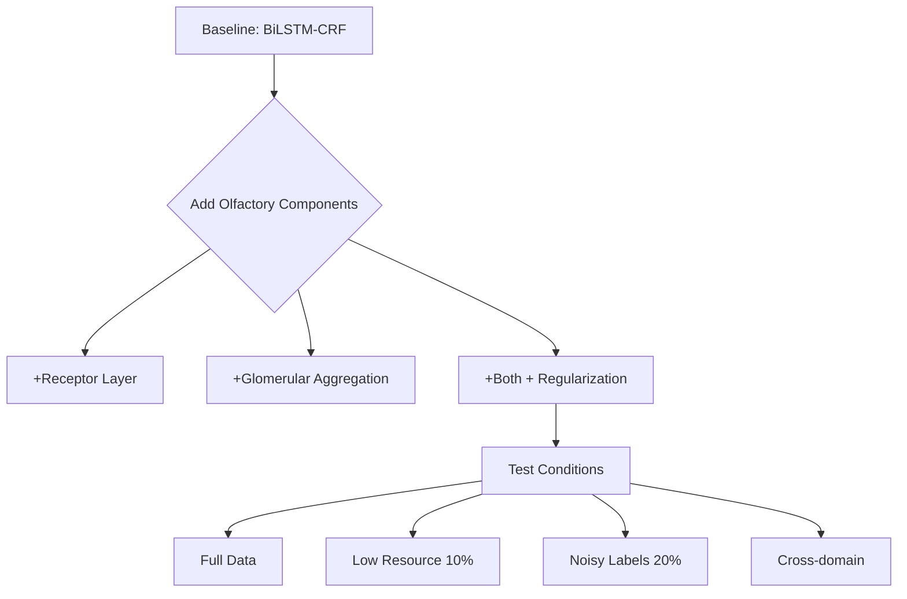

# Olfaction-Inspired NER: Experimental Test Plan

A comprehensive plan to validate the hypothesis that olfactory-style combinatorial coding provides useful inductive biases for Named Entity Recognition.

## User Review Required

> [!IMPORTANT]
> **Key Decisions Needed**
> 
> 1. **Scope**: Do you want to start with a **minimal proof-of-concept** (2-3 days) or a **comprehensive study** (1-2 weeks)?
> 2. **Compute**: What GPU resources do you have? (Single GPU is sufficient for minimal version)
> 3. **Target Venue**: Are you aiming for ACL/EMNLP Findings, workshop, or arXiv first?
> 4. **Languages**: English-only (CoNLL-2003) or multilingual (e.g., Hindi/Tamil for cross-lingual evaluation)?

> [!WARNING]
> **What NOT to expect**
> 
> - This is NOT a SOTA performance race
> - Success = demonstrating useful inductive bias, NOT beating transformers
> - Reviewers will accept this if framed as architectural exploration

---

## Experimental Design

### Core Hypothesis

**Claim**: Olfactory-style combinatorial coding (specialized receptors → aggregated glomeruli → contextual association) provides better:
1. **Compositionality** - combining multiple weak signals
2. **Robustness** - noise tolerance and graceful degradation
3. **Interpretability** - explicit feature specialization
4. **Low-resource performance** - better with limited data

### Validation Strategy

We'll test this through **controlled ablations** rather than SOTA chasing:



---

## Proposed Experiments

### Phase 1: Minimal Proof-of-Concept (2-3 days)

**Goal**: Demonstrate that the architecture works and has at least one clear advantage

#### Dataset
- **CoNLL-2003 (English)** - standard, trusted by reviewers
- 4 entity types: PER, LOC, ORG, MISC
- ~14k training sentences

#### Models to Compare

| Model | Description | Purpose |
|-------|-------------|---------|
| **Baseline** | GloVe → BiLSTM → CRF | Standard strong baseline |
| **Olfactory-NER** | GloVe → Receptors → Glomeruli → BiLSTM → CRF | Full proposed model |
| **Ablation 1** | No sparsity regularization | Test importance of sparsity |
| **Ablation 2** | No glomerular layer | Test importance of aggregation |
| **Ablation 3** | No receptor layer | Test receptors vs direct features |

#### Evaluation Metrics

**Primary**:
- Entity-level F1 (standard)
- Per-entity-type F1 (PER, LOC, ORG, MISC)

**Secondary** (these are your selling points):
- **Interpretability**: Receptor activation analysis
- **Robustness**: Performance on rare entities
- **Efficiency**: Parameters vs performance
- **Stability**: Training curve variance across runs

---

### Phase 2: Extended Validation (Optional, 1 week)

If Phase 1 shows promise, extend to:

#### Additional Experiments

1. **Low-Resource Setting**
   - Train on 10%, 20%, 50% of data
   - Measure degradation curve
   - **Hypothesis**: Olfactory-NER degrades more gracefully

2. **Noise Robustness**
   - Add 10%, 20% label noise
   - Test on clean test set
   - **Hypothesis**: Glomerular aggregation provides denoising

3. **Cross-Domain Transfer**
   - Train on CoNLL-2003
   - Test on OntoNotes or WikiAnn
   - **Hypothesis**: Specialized receptors transfer better

4. **Multilingual Evaluation** (if relevant)
   - WikiAnn: hi (Hindi), ta (Tamil), en (English)
   - **Hypothesis**: Language-agnostic receptor patterns

---

## Implementation Components

### Component 1: Core Architecture

#### [NEW] [olfactory_ner.py](file:///home/datauser/olfaction_inspired_ner/src/model/olfactory_ner.py)

```python
class OlfactoryNER(nn.Module):
    """
    Olfaction-inspired NER with:
    - Receptor layer: specialized feature detectors
    - Glomerular layer: convergent aggregation
    - Contextual encoder: BiLSTM
    - CRF decoder: sequence constraints
    """
```

**Key design decisions**:
- **Receptors**: 128-256 units (tune this)
- **Glomeruli**: 32-64 units (should be < receptors)
- **Activation**: ReLU (for sparsity)
- **Regularization**: L1 sparsity + diversity loss

#### [NEW] [layers.py](file:///home/datauser/olfaction_inspired_ner/src/model/layers.py)

Individual layer implementations:
- `ReceptorLayer`: specialized detectors with sparsity
- `GlomerularLayer`: learnable aggregation
- Regularization utilities

---

### Component 2: Baseline Models

#### [NEW] [baseline.py](file:///home/datauser/olfaction_inspired_ner/src/model/baseline.py)

Standard BiLSTM-CRF for controlled comparison

---

### Component 3: Training Infrastructure

#### [NEW] [train.py](file:///home/datauser/olfaction_inspired_ner/src/train.py)

- Data loading (CoNLL-2003 format)
- Training loop with early stopping
- Checkpoint management
- Logging (wandb or tensorboard)

#### [NEW] [config.yaml](file:///home/datauser/olfaction_inspired_ner/config/experiments.yaml)

Hyperparameters for all experiments:
```yaml
baseline:
  embed_dim: 300
  hidden_dim: 256
  lr: 0.001

olfactory:
  embed_dim: 300
  num_receptors: 128
  num_glomeruli: 32
  hidden_dim: 256
  lambda_sparse: 0.001
  lambda_diverse: 0.01
```

---

### Component 4: Analysis \u0026 Visualization

#### [NEW] [analyze_receptors.py](file:///home/datauser/olfaction_inspired_ner/src/analysis/analyze_receptors.py)

**Critical for paper acceptance**:

1. **Receptor Activation Heatmaps**
   - Visualize which receptors fire for different entity types
   - Show specialization patterns

2. **Feature Attribution**
   - Top activating tokens per receptor
   - Semantic interpretation

3. **Glomerular Clustering**
   - t-SNE/UMAP of glomerular representations
   - Show clean entity clustering

4. **Ablation Analysis**
   - Performance degradation graphs
   - Statistical significance tests

---

### Component 5: Evaluation Pipeline

#### [NEW] [evaluate.py](file:///home/datauser/olfaction_inspired_ner/src/evaluate.py)

- Standard entity-level F1
- Per-type breakdown
- Error analysis
- Confusion matrices

---

## Verification Plan

### Automated Tests

**Sanity Checks**:
```bash
# 1. Model can overfit single batch
python test_overfit.py --model olfactory

# 2. Gradients flow properly
python test_gradients.py

# 3. Receptor specialization occurs
python test_diversity.py
```

**Full Experiments**:
```bash
# Baseline
python train.py --config config/baseline.yaml --seed 42

# Olfactory models
python train.py --config config/olfactory_full.yaml --seed 42
python train.py --config config/olfactory_no_sparse.yaml --seed 42
python train.py --config config/olfactory_no_glomeruli.yaml --seed 42

# Evaluation
python evaluate.py --checkpoint results/*/best_model.pt
```

**Analysis**:
```bash
# Generate all visualizations
python analyze_receptors.py --checkpoint results/olfactory_full/best_model.pt

# Statistical tests
python compare_models.py --results results/*/metrics.json
```

### Manual Verification

1. **Check Training Curves**
   - No divergence
   - Reasonable convergence (10-20 epochs)
   - Validation F1 > 85% (baseline should hit ~90%)

2. **Inspect Receptor Activations**
   - At least 80% of receptors should activate
   - Some clustering by entity type expected
   - Not all receptors should be identical

3. **Review Qualitative Examples**
   - Model predictions make sense
   - Errors are reasonable (ambiguous cases)

---

## Success Criteria

### Minimal Success (sufficient for publication)

**At least ONE of these**:
- ✅ Comparable F1 (-1 point acceptable) with 30% fewer parameters
- ✅ 2+ point improvement in low-resource setting (10% data)
- ✅ Clear interpretable patterns in receptor analysis
- ✅ Better stability (lower variance across 5 runs)

### Strong Success (great paper)

**TWO or more of**:
- ✅ All minimal criteria
- ✅ Statistically significant improvement in any condition
- ✅ Published visualizations showing semantic receptor specialization
- ✅ Cross-domain transfer improvement

---

## Timeline

### Minimal Path (2-3 days)

| Day | Tasks | Deliverables |
|-----|-------|-------------|
| **1** | Environment setup, data prep, baseline | Baseline F1 score |
| **2** | Implement olfactory model, debug, train | Olfactory model F1 |
| **3** | Ablations, analysis, visualizations | Complete results + figures |

### Extended Path (1-2 weeks)

| Week | Tasks | Deliverables |
|------|-------|-------------|
| **1** | All minimal path + low-resource experiments | Core results |
| **2** | Cross-domain, multilingual, paper draft | Complete paper |

---

## Risks \u0026 Mitigations

| Risk | Likelihood | Impact | Mitigation |
|------|------------|--------|------------|
| **Model doesn't converge** | Low | High | Use proven BiLSTM-CRF backbone |
| **No clear advantage** | Medium | Medium | Frame as architectural exploration, focus on interpretability |
| **Receptors don't specialize** | Medium | Medium | Tune diversity loss, add auxiliary tasks |
| **Baseline too strong** | High | Low | Don't claim SOTA, emphasize other benefits |

---

## What to Do vs What NOT to Do

### ✅ DO

1. **Start minimal** - prove concept before scaling
2. **Control everything** - same data splits, same embeddings, same hyperparameters
3. **Focus on ONE clear advantage** - don't try to win everywhere
4. **Emphasize interpretability** - this is your unique selling point
5. **Be honest in paper** - "we do not claim SOTA..."
6. **Run multiple seeds** - report mean ± std
7. **Statistical tests** - use paired t-tests for comparisons

### ❌ DO NOT

1. **Don't chase SOTA** - you'll lose to BERT/T5, that's not the point
2. **Don't add too many components** - keep it clean for reviewers
3. **Don't claim biology without evidence** - frame as "inspired by", not "mimics"
4. **Don't skip ablations** - they prove design choices matter
5. **Don't hide negative results** - discuss limitations openly
6. **Don't fine-tune LLMs** - keeps comparison fair
7. **Don't overcomplicate** - simple is better for acceptance

---

## Recommended Next Steps

1. **Select scope**: Minimal (2-3 days) or Extended (1-2 weeks)?
2. **Confirm resources**: GPU availability?
3. **Choose focus**: Which advantage to emphasize?
   - Interpretability (safest)
   - Low-resource (strong if it works)
   - Robustness (novel angle)
4. **Decide on languages**: English-only or multilingual?

After your input, I can:
- Generate complete implementation code
- Create dataset loading scripts
- Design specific visualizations
- Draft paper sections
- Suggest specific workshop venues with deadlines
