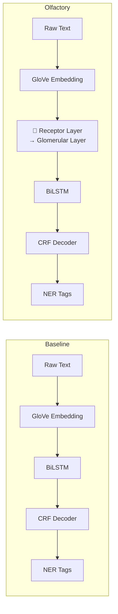

# Olfaction-Inspired NER — Complete Architecture Guide

This document explains the **full data & model pipeline** for both the **baseline** (standard) and the **olfactory-enhanced** GloVe-based architectures.

---

## Table of Contents

1. [High-Level Overview](#1-high-level-overview)
2. [Input — What Goes In](#2-input--what-goes-in)
3. [Text → Vectors — How Words Become Numbers](#3-text--vectors--how-words-become-numbers)
4. [Architecture A — Baseline (Without Olfactory Layers)](#4-architecture-a--baseline-without-olfactory-layers)
5. [Architecture B — Olfactory-Enhanced](#5-architecture-b--olfactory-enhanced)
6. [The Olfactory Layers In-Depth](#6-the-olfactory-layers-in-depth)
7. [Output — What Comes Out](#7-output--what-comes-out)
8. [End-to-End Tensor Shape Walk-Through](#8-end-to-end-tensor-shape-walk-through)
9. [Loss & Training](#9-loss--training)
10. [Ablation Switches](#10-ablation-switches)
11. [File Map](#11-file-map)

---

## 1. High-Level Overview



The **only structural difference** between baseline and olfactory models is the insertion of the **Receptor → Glomerular** layers between the embeddings and the sequence encoder.

---

## 2. Input — What Goes In

| What        | Example                                     | Format                            |
|-------------|---------------------------------------------|-----------------------------------|
| **Sentence** | `"EU rejects German call to boycott"` | A list of tokens (words) |
| **NER Labels** | `["B-ORG", "O", "B-MISC", "O", "O", "O"]` | IOB2 tags per token |

### Input Sources

| Format | Tokenizer | Datasets |
|--------|-----------|----------|
| CoNLL-format `.txt` files (`word POS chunk NER-tag`) | Word-level vocabulary (`word2idx` dict) | CoNLL-2003, WikiANN |

---

## 3. Text → Vectors — How Words Become Numbers

### GloVe Embeddings

```
"EU"  →  word2idx["EU"] = 42  →  Embedding(42) → [0.12, -0.34, ..., 0.07]  (300-d vector)
```

| Step | What Happens | Output Shape |
|------|-------------|--------------|
| 1. **Build vocabulary** | Scan training set, assign an integer index to every word with freq ≥ 2. Special tokens: `<PAD>=0`, `<UNK>=1` | `word2idx` dict (~20k entries) |
| 2. **Look up indices** | Each word → its integer index. Unknown words → `<UNK>` index | `[batch, seq_len]` int tensor |
| 3. **Embedding lookup** | `nn.Embedding` maps each index to a 300-d vector, initialized from GloVe (`glove.6B.300d.txt`) | `[batch, seq_len, 300]` |
| 4. **Dropout** | Applied to embeddings for regularization (p = 0.5) | `[batch, seq_len, 300]` |

---

## 4. Architecture A — Baseline (Without Olfactory Layers)

### GloVe Baseline: `BaselineNER` 
**File:** [`baseline.py`](file:///c:/Users/Admin/OneDrive/Desktop/olfaction-inspired-ner/src/model/baseline.py)

```
Tokens [batch, seq]
  │
  ▼
Embedding (GloVe 300-d)           → [batch, seq, 300]
  │
  ▼
Dropout (p=0.5)                   → [batch, seq, 300]
  │
  ▼
BiLSTM (hidden=256, 1 layer)      → [batch, seq, 512]   (256×2 for bidirectional)
  │
  ▼
Linear (512 → num_tags)           → [batch, seq, 9]     (emission scores)
  │
  ▼
CRF Decoder                      → [batch, seq]          (predicted tag indices)
```


---

## 5. Architecture B — Olfactory-Enhanced

### GloVe + Olfactory: `OlfactoryNER`
**File:** [`olfactory_ner.py`](file:///c:/Users/Admin/OneDrive/Desktop/olfaction-inspired-ner/src/model/olfactory_ner.py)

```
Tokens [batch, seq]
  │
  ▼
Embedding (GloVe 300-d)                  → [batch, seq, 300]
  │
  ▼
Dropout (p=0.5)                          → [batch, seq, 300]
  │
  ▼
🧬 Receptor Layer (300 → 128 receptors)  → [batch, seq, 128]    ← NEW
  │
  ▼
🧬 Glomerular Layer (128 → 32 glomeruli) → [batch, seq, 32]     ← NEW
  │
  ▼
Dropout (p=0.5)                          → [batch, seq, 32]
  │
  ▼
BiLSTM (input=32, hidden=256)            → [batch, seq, 512]
  │
  ▼
Linear (512 → num_tags)                  → [batch, seq, 9]
  │
  ▼
CRF Decoder                             → [batch, seq]
```


---

## 6. The Olfactory Layers In-Depth

**File:** [`layers.py`](file:///c:/Users/Admin/OneDrive/Desktop/olfaction-inspired-ner/src/model/layers.py)

### 6.1 Biological Analogy

| Biology | Model Equivalent |
|---------|-----------------|
| **Odorant molecules** bind to olfactory receptor neurons (ORNs) | Input embeddings enter the Receptor Layer |
| Each ORN expresses **one specific receptor** — highly specialized | Each receptor unit is a small linear projection tuned to detect specific features |
| ORN responses are **sparse** (few fire strongly) | ReLU activation enforces sparsity — most outputs are zero |
| Multiple ORNs with the **same receptor converge** to one glomerulus | Glomerular Layer aggregates groups of receptors |
| Glomeruli provide **noise reduction + signal amplification** | Learnable aggregation acts as feature pooling |

### 6.2 Receptor Layer — Math

```
r = ReLU(x · Wᵀ + b)
```

| Symbol | Shape | Meaning |
|--------|-------|---------|
| `x` | `[batch, seq, input_dim]` | Input embeddings (300 or 768) |
| `W` | `[num_receptors, input_dim]` | Receptor weight matrix (each row = one receptor) |
| `b` | `[num_receptors]` | Bias |
| `r` | `[batch, seq, num_receptors]` | Receptor activations (sparse due to ReLU) |

Implementation uses `torch.einsum('bsd,rd->bsr', x, W)` for efficiency.

**Diversity Regularization:** To prevent receptors from learning redundant features, a diversity loss penalizes high cosine similarity between receptor weight vectors:

```
L_diverse = mean(|cosine_sim(Wᵢ, Wⱼ)|)   for all i ≠ j
```

### 6.3 Glomerular Layer — Math

```
g = ReLU(r · Aᵀ)
```

| Symbol | Shape | Meaning |
|--------|-------|---------|
| `r` | `[batch, seq, num_receptors]` | Receptor activations |
| `A` | `[num_glomeruli, num_receptors]` | Assignment/aggregation matrix |
| `g` | `[batch, seq, num_glomeruli]` | Glomerular activations |

The key idea: `num_glomeruli < num_receptors` (default: 32 < 128), so this layer acts as a **learned dimensionality reduction** — grouping related receptor responses into higher-level features.

### 6.4 Combined Effect

```
300-d embedding → 128 receptor features (expansion + sparsification)
                → 32 glomerular features  (compression + denoising)
```

The olfactory layers transform a dense 300-d (or 768-d) embedding into a compact, sparse, 32-d representation before it enters the sequence encoder.

---

## 7. Output — What Comes Out

### During Training → Loss (scalar)

The **CRF** computes negative log-likelihood:

```
Loss = -log P(y* | x) = -(score(y*) - log Σ_y exp(score(y)))
```

Where `score(y)` = emission scores + transition scores + start/end scores.

Optionally, the total loss includes regularization terms:
```
Total Loss = CRF Loss + λ_sparse × Sparsity Loss + λ_diverse × Diversity Loss
```

### During Inference → Tag Predictions

The **CRF** uses the **Viterbi algorithm** to find the highest-scoring tag sequence:

```
y* = argmax_y  score(y)
```

**Output:** `[batch, seq_len]` — integer tag indices (e.g., `0=O, 1=B-LOC, 2=I-LOC, ...`)

These are mapped back to string labels via `idx2label`:
```
[3, 0, 5, 0, 0, 0] → ["B-ORG", "O", "B-MISC", "O", "O", "O"]
```

---

## 8. End-to-End Tensor Shape Walk-Through

### GloVe + Olfactory (default config)

| Stage | Operation | Output Shape | Example Size |
|-------|-----------|-------------|--------------|
| Input tokens | word indices | `[32, 50]` | batch=32, seq=50 |
| Embedding | GloVe lookup | `[32, 50, 300]` | 300-d vectors |
| Receptor | `x·Wᵀ+b` → ReLU | `[32, 50, 128]` | 128 receptors |
| Glomeruli | `r·Aᵀ` → ReLU | `[32, 50, 32]` | 32 glomeruli |
| BiLSTM | bidir hidden | `[32, 50, 512]` | 256×2 |
| Linear | projection | `[32, 50, 9]` | 9 NER tags |
| CRF decode | Viterbi | `[32, 50]` | tag indices |


---

## 9. Loss & Training

### CRF Loss (shared by all models)

**File:** [`crf.py`](file:///c:/Users/Admin/OneDrive/Desktop/olfaction-inspired-ner/src/model/crf.py)

The CRF models tag-to-tag transitions with three learnable parameter sets:

| Parameter | Shape | Purpose |
|-----------|-------|---------|
| `transitions` | `[num_tags, num_tags]` | Score of transitioning from tag i → tag j |
| `start_transitions` | `[num_tags]` | Score of starting with tag i |
| `end_transitions` | `[num_tags]` | Score of ending with tag i |

**Training:** Forward algorithm computes the partition function (log-sum-exp over all possible tag sequences).

**Inference:** Viterbi algorithm finds the optimal tag sequence using dynamic programming + backtracking.

### Regularization (Olfactory models only)

| Loss Term | Weight | Purpose |
|-----------|--------|---------|
| `λ_sparse` | 0.001 | Encourages sparse receptor activations |
| `λ_diverse` | 0.01 | Prevents receptor weight redundancy |

---

## 10. Ablation Switches

The `OlfactoryNER` model supports ablation flags to isolate the contribution of each component:

| Flag | Default | Effect When `False` |
|------|---------|---------------------|
| `use_receptors` | `True` | Skips olfactory layers entirely → becomes BiLSTM-CRF baseline |
| `use_glomeruli` | `True` | Receptor output goes directly to BiLSTM (no compression) |
| `use_crf` | `True` | Replaces CRF with `CrossEntropyLoss` + `argmax` decoding |

Predefined experiment configs are in [`experiments.yaml`](file:///c:/Users/Admin/OneDrive/Desktop/olfaction-inspired-ner/config/experiments.yaml):
- `baseline` — no olfactory layers
- `olfactory_full` — all layers enabled
- `olfactory_no_sparse` — olfactory layers with `λ_sparse = 0`
- `olfactory_no_glomeruli` — receptors only, no glomerular layer

---

## 11. File Map

```
src/model/
├── layers.py          # ReceptorLayer, GlomerularLayer, OlfactoryEncoder
├── olfactory_ner.py   # OlfactoryNER (GloVe + olfactory + BiLSTM + CRF)
├── baseline.py        # BaselineNER (GloVe + BiLSTM + CRF)
└── crf.py             # CRF layer (transition scores, Viterbi decode)

src/data/
├── dataset.py         # CoNLL-2003 loading, word vocab, GloVe embeddings
└── unified_loader.py  # Unified loader for all datasets/languages

config/
└── experiments.yaml   # Experiment configs (baseline, ablations, hyperparams)
```
