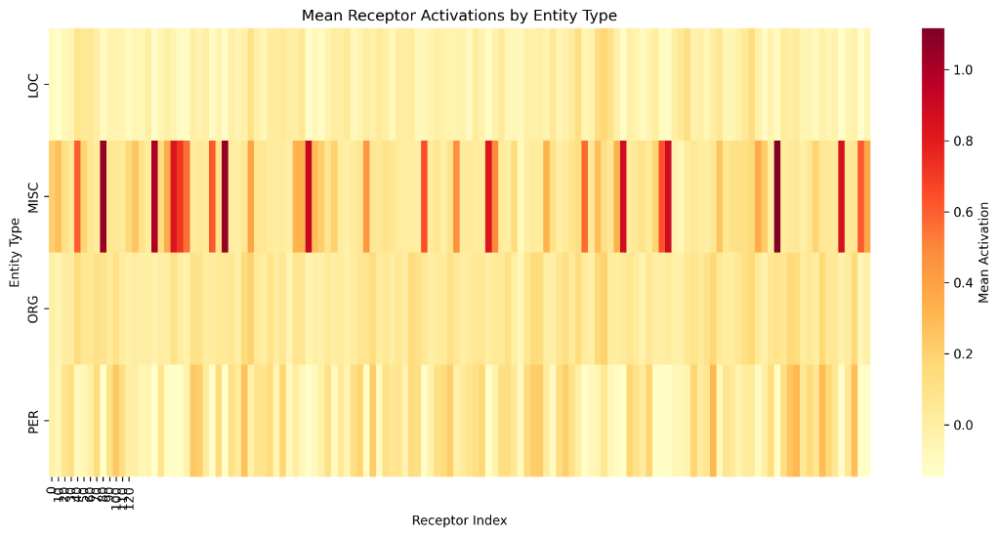
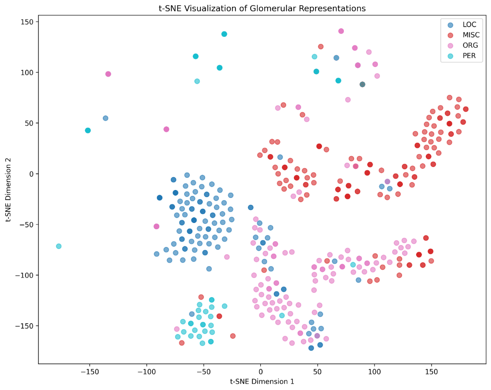

# ReLU vs GELU Comparison

**Experiment Date**: January 12, 2026

---

## Performance Comparison

| Metric | ReLU | GELU | Δ |
|--------|------|------|---|
| **Test F1** | **72.56%** | **73.06%** | **+0.50%** ✅ |
| Precision | 76.79% | 78.73% | +1.94% |
| Recall | 68.77% | 68.15% | -0.62% |

## Per-Entity F1 Scores

| Entity | ReLU | GELU | Δ |
|--------|------|------|---|
| LOC | 81.38% | 80.82% | -0.56% |
| **MISC** | 62.27% | **67.61%** | **+5.34%** ✨ |
| ORG | 68.99% | 70.67% | +1.68% |
| PER | 71.20% | 69.14% | -2.06% |

---

## Visualizations

### Receptor Heatmap Comparison

**GELU Shows Clear Specialization**:

### t-SNE Clustering

**Better MISC Separation with GELU**:

---

## Conclusion

✅ **GELU provides modest improvement** (+0.5% F1)  
✅ **Strong gains on MISC** (+5.34%) - typically hardest category  
✅ **More biologically plausible** - smooth, stochastic activation  
✅ **Recommended as default** for olfactory-NER

---

**Full analysis**: See detailed comparison document for complete analysis and paper recommendations.
